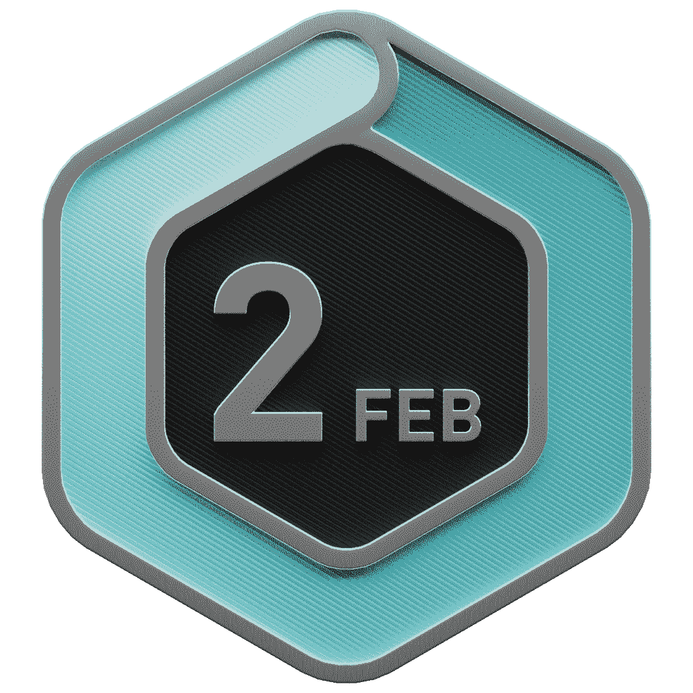
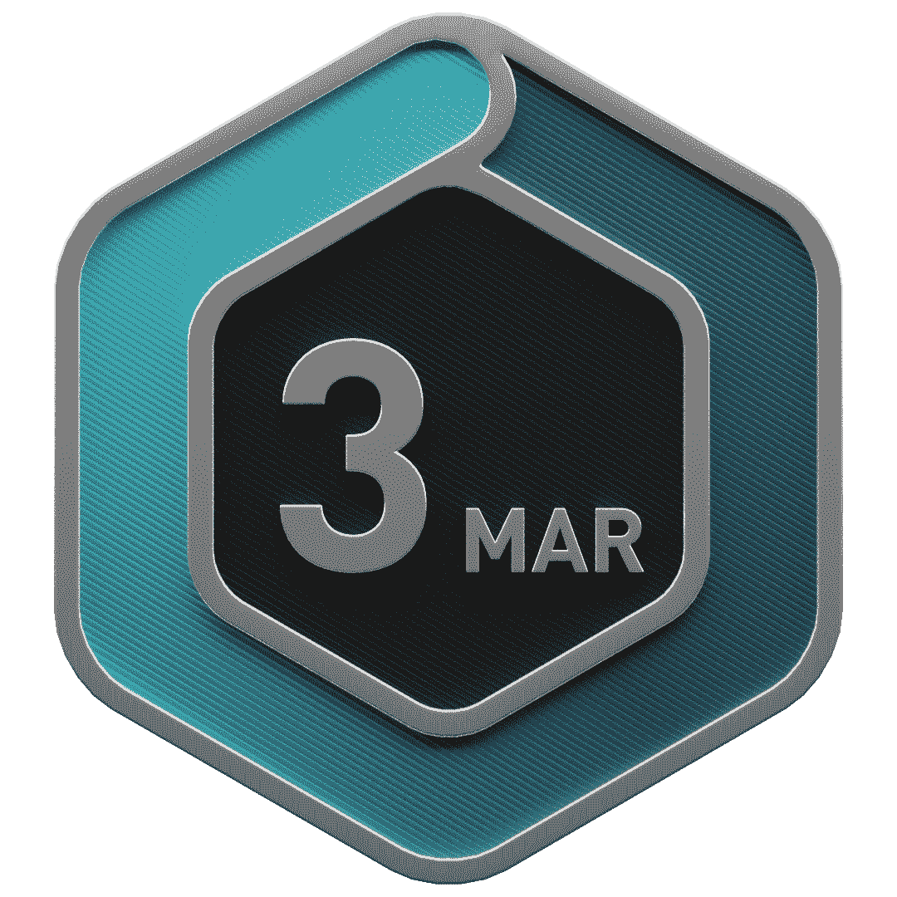
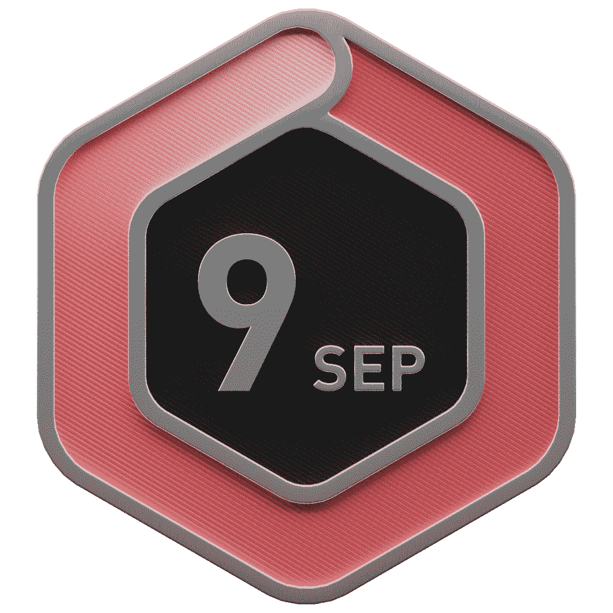
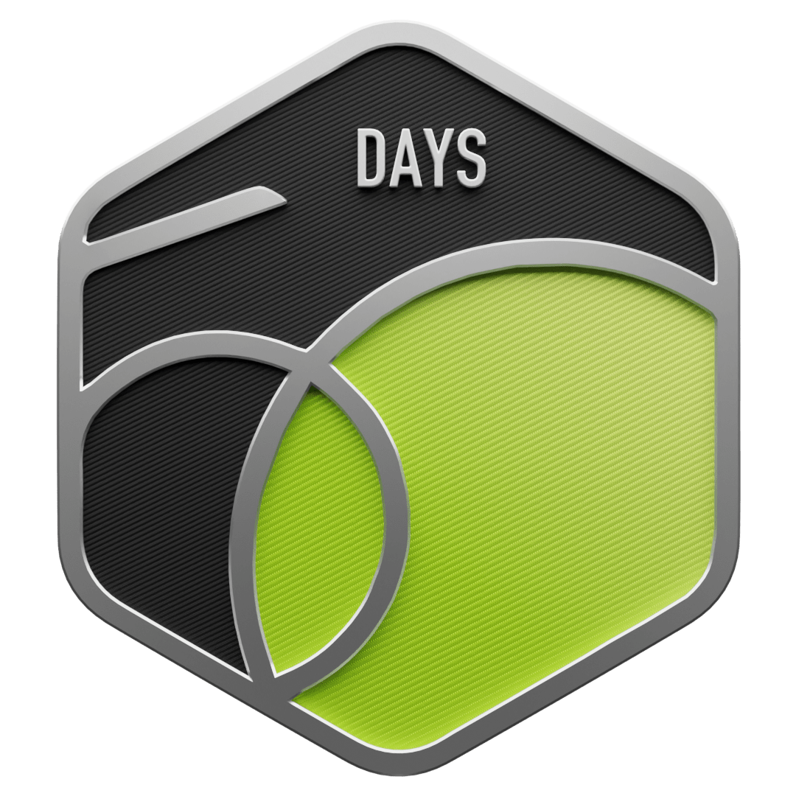
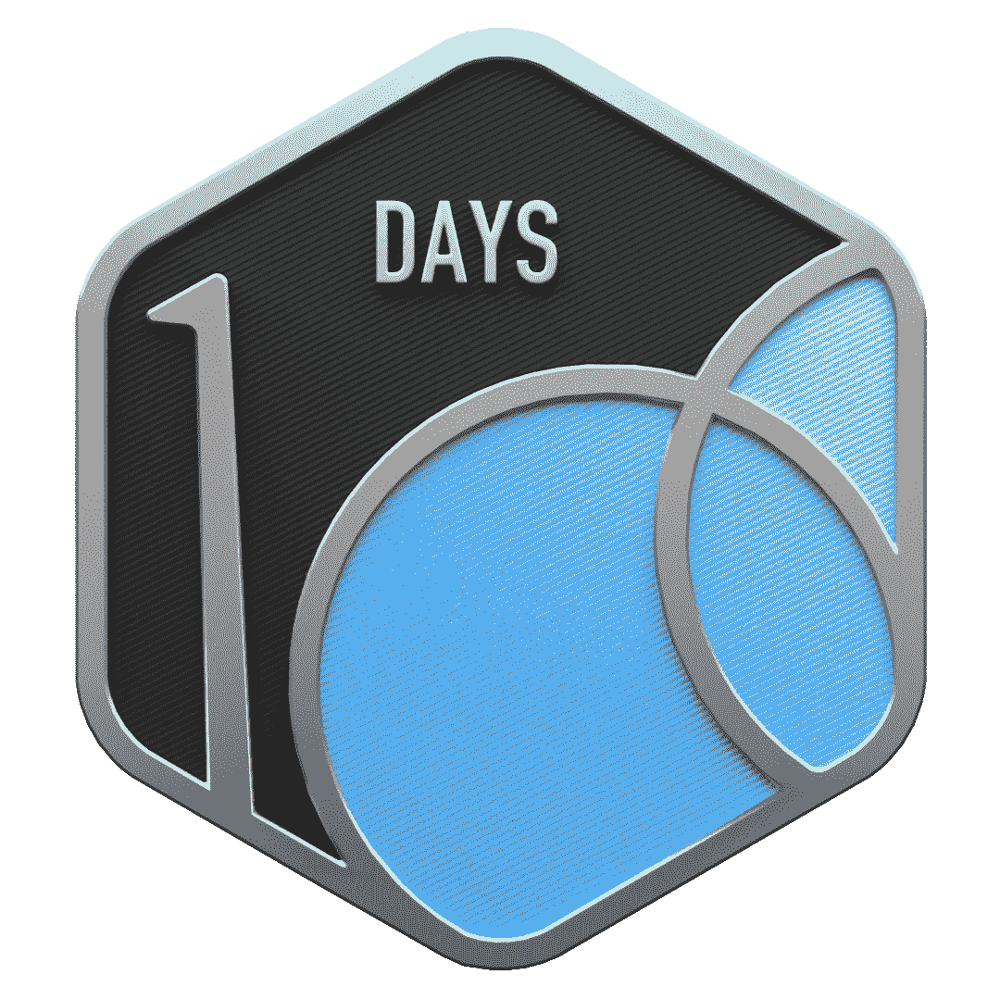
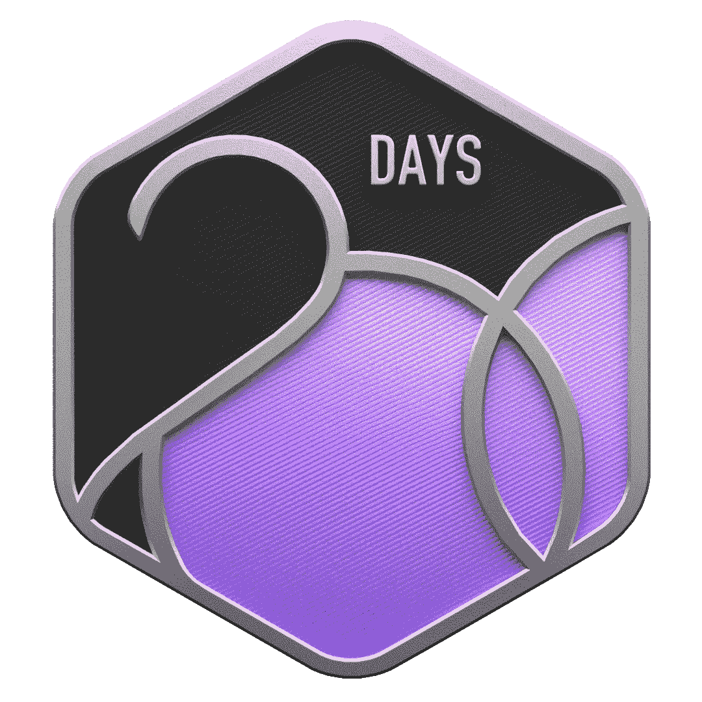
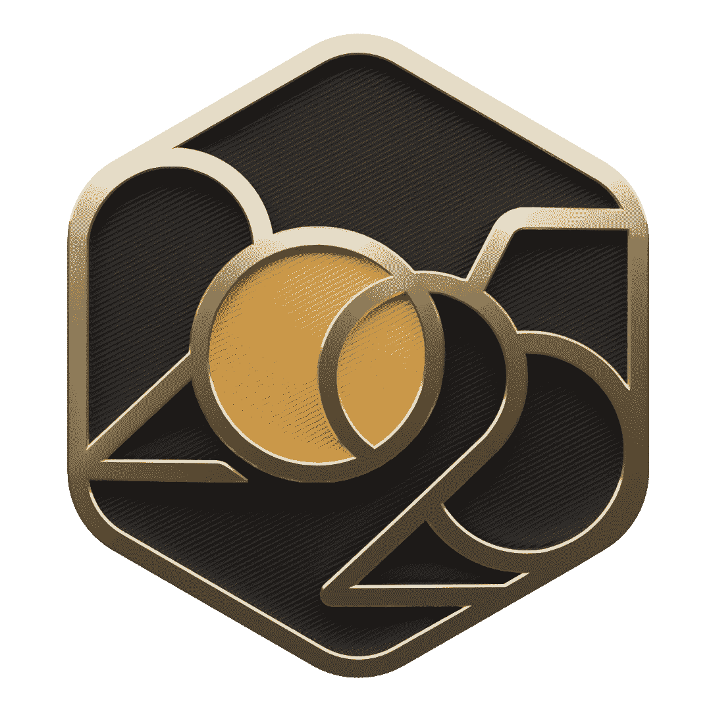

# LeetCode DCC Repository

Welcome to the **LeetCode (Daily Coding Challenge) Solutions** repository! 🚀  

This repository is dedicated to maintaining solutions for various problems from [LeetCode](https://leetcode.com/). Here, you'll find my implementations, optimized solutions, and explanations for solving these problems.  

---

## 📂 Directory Structure

```
LeetCode/
|
|-- 123. Problem Name /
|   |-- solution.py
|-- 456. Problem Name /
|   |-- solution.py
|-- README.md
```

- **Problem Name**: Folder for the specific problem, containing the solution file.
- **solution.py**: Python file containing the implementation for the problem.

---

## 🚀 Features

- **Consistent Updates**: Solutions will be added regularly.
- **Optimized Implementations**: Focus on time and space complexity.
- **Language Support**: Solutions are implemented using Python.
- **Approach Explanation**: Detailed explanations for better understanding.

---

## 🔧 How to Use

1. Clone the repository:
    ```bash
    git clone https://github.com/RizwanMolla/LeetCode.git
    ```
2. Navigate to the folder for the specific problem.
3. Open the solution file to view the implementation.

---

## 🗂️ Example Structure

```
LeetCode/
|
|-- Problem Name/
|   |-- solution.py
```

- **solution.py**: Contains the solution code for the problem.

---

## 📝 Contribution Guidelines

This is a personal repository; however, suggestions and improvements are always welcome. Feel free to fork the repository and submit a pull request.

---

## 🌟 Acknowledgments

- Thanks to [LeetCode](https://leetcode.com/) for curating an excellent set of problems.
- Inspired by the amazing coding community.

---

## 🏆 Achievements

- **Monthly Progress Streak:** Consistently earned LeetCode monthly challenge badges from Nov 2024 onward, completing all months in 2025.

### LeetCode Monthly Badge Streak

<p align="center">

  <!-- 2024 -->
  
  
  <br>

  <!-- 2025 -->
  
  
  
  <br>

  
  
  
  <br>

  
  
  
  <br>

  
  
  <br>

  <!-- Other badges -->
  
  
  
  <br>

  
  

</p>


## 📫 Contact  

For any questions or discussions, feel free to reach out on:  
- **X (formerly Twitter)**: [@MdRizwanMolla](https://x.com/MdRizwanMolla)  
- **LinkedIn**: [@rizwan-molla](https://www.linkedin.com/in/rizwan-molla/)  
