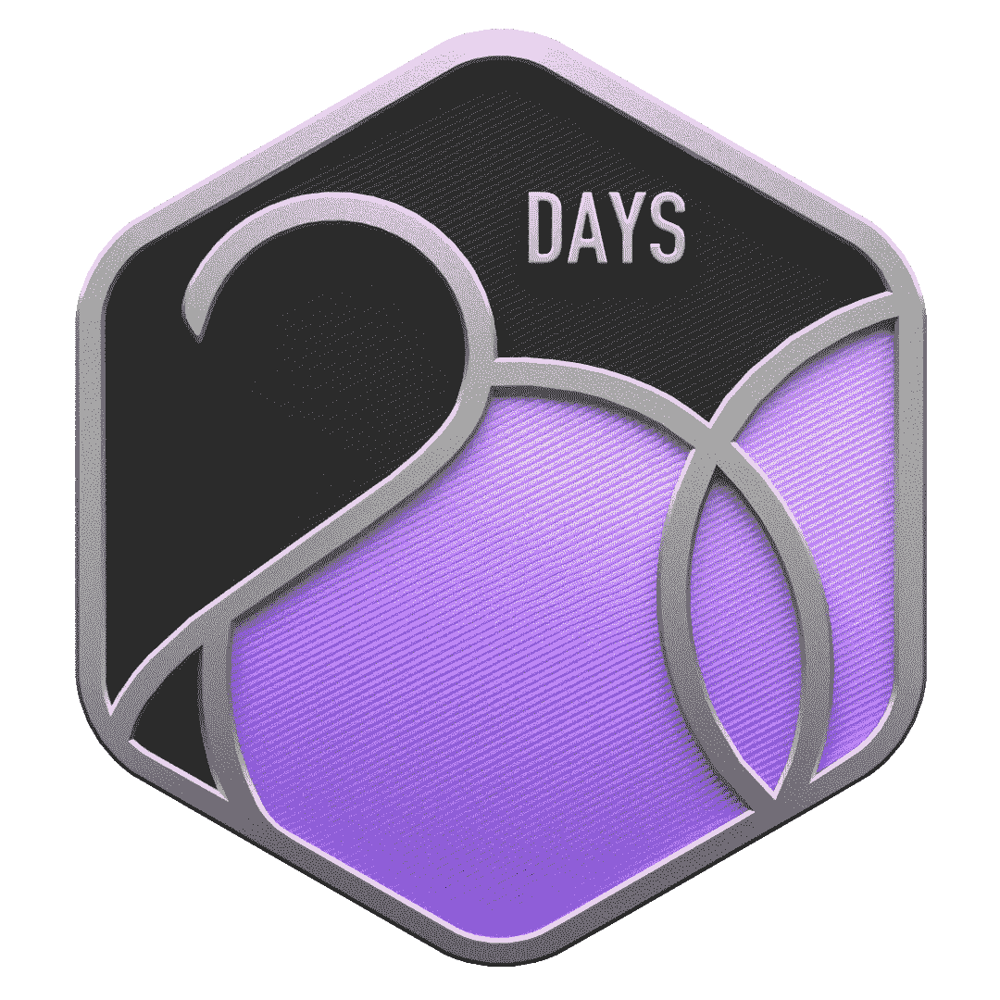

# LeetCode DCC Repository

LeetCode solutions organized for fast browsing by problem number range.

This repository tracks Daily Coding Challenge progress, keeps solutions easy to find, and is structured to scale as the collection grows.

## Table of Contents

- [Overview](#overview)
- [Quick Navigation](#quick-navigation)
- [LeetCode Monthly Badge Streak](#leetcode-monthly-badge-streak)
- [Directory Structure](#directory-structure)
- [How to Find a Problem Quickly](#how-to-find-a-problem-quickly)
- [Features](#features)
- [Contribution Guidelines](#contribution-guidelines)
- [Acknowledgments](#acknowledgments)
- [Contact](#contact)

## Overview

- Platform: [LeetCode](https://leetcode.com/)
- Primary language: Python
- Also included: selected Java solutions
- Organization style: problem-number buckets (`1-1000`, `1001-2000`, ...)

## Quick Navigation

- [Browse 1-1000](1-1000)
- [Browse 1001-2000](1001-2000)
- [Browse 2001-3000](2001-3000)
- [Browse 3001-4000](3001-4000)
- [View badges](badges)

---
### LeetCode Monthly Badge Streak

<p align="center">

  <!-- Outer layer (new badges) -->
  
  
  
  
  <br>

  <!-- Core + expanded honeycomb -->
  
  
  
  
  
  <br>

  
  
  
  
  
  
  <br>

  
  
  
  
  
  
  
  <br>

  
  
  
  
  
  
  <br>

  <!-- Other badges -->
  
  
  
  

</p>

---

## Directory Structure

```
LeetCode/
|
|-- 1-1000/
|   |-- 11. Container With Most Water/
|   |   |-- solution.py
|-- 1001-2000/
|   |-- 1007. Minimum Domino Rotations For Equal Row/
|   |   |-- solution.py
|-- 2001-3000/
|   |-- 2017. Grid Game/
|   |   |-- solution.py
|-- 3001-4000/
|   |-- 3169. Count Days Without Meetings/
|   |   |-- solution.py
|-- badges/
|-- README.md
```

- **Range folders** (`1-1000`, `1001-2000`, etc.): Group problems by problem-number range.
- **Problem folder**: Folder for the specific problem, containing the solution file.
- **solution.py**: Python file containing the implementation for the problem.

### Browse by Problem Range

| Range | Folder Link | Problems |
|---|---|---:|
| 1-1000 | [1-1000](1-1000) | 68 |
| 1001-2000 | [1001-2000](1001-2000) | 124 |
| 2001-3000 | [2001-3000](2001-3000) | 144 |
| 3001-4000 | [3001-4000](3001-4000) | 182 |

---

## How to Find a Problem Quickly

1. Locate the problem number.
2. Open the corresponding range folder.
3. Open the exact problem directory.

Examples:

- Problem 118 -> [1-1000](1-1000)
- Problem 1262 -> [1001-2000](1001-2000)
- Problem 2471 -> [2001-3000](2001-3000)

Range formula:

- Bucket start = `floor((n - 1) / 1000) * 1000 + 1`
- Bucket end = `bucket start + 999`

---

## Features

- **Scalable Organization**: Number-range buckets keep navigation manageable as the repo grows.
- **Consistent Updates**: New solved problems are added regularly.
- **Optimization Focus**: Solutions prioritize time and space efficiency.
- **Mixed Language Support**: Primarily Python, with Java for selected problems.
- **Clean Problem Layout**: One folder per problem, with solution files kept simple and direct.

---

## How to Use

1. Clone the repository:
    ```bash
    git clone https://github.com/RizwanMolla/LeetCode.git
    ```
2. Navigate to the correct range folder based on the problem number.
3. Open the problem folder.
4. Open the solution file to view the implementation.

---

## Contribution Guidelines

This is a personal repository, but suggestions are welcome.

If you want to contribute:

1. Fork the repository.
2. Create a branch.
3. Add your improvement.
4. Open a pull request.

---

## Acknowledgments

- Thanks to [LeetCode](https://leetcode.com/) for curating an excellent set of problems.
- Inspired by the amazing coding community.

---

## Achievements

- **Monthly Progress Streak:** Consistently earned LeetCode monthly challenge badges from Nov 2024 onward, including all months in 2025.


## Contact  

For any questions or discussions, feel free to reach out on:  
- **X (formerly Twitter)**: [@MdRizwanMolla](https://x.com/MdRizwanMolla)  
- **LinkedIn**: [@rizwan-molla](https://www.linkedin.com/in/rizwan-molla/)  
